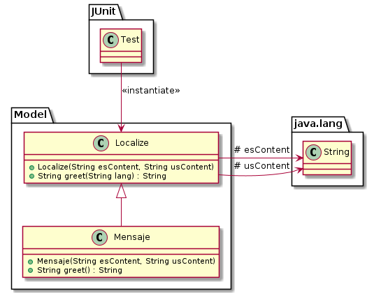

# Diagramas UML

**Recomendamos la utilización de PlantUML por las siguientes razones**:

- Se pueden versionar los distintos diagramas.
- Existen herramientas que lo interpretan y no requiere la instalación de un software. Ver [aquí](#editor-online).
- Permite la utilización de `include` y *variables*, lo cual facilita la actualización de los diagramas.

## Herramientas

### Plantuml

Para trabajar localmente con [Plantuml](https://plantuml.com/) necesitará instalar la aplicación java. Las instrucciones las encontrarán [aquí](https://plantuml.com/starting).

### Script de traducción

Utilizando el script `render_diagrams.sh` se pueden generar los archivos `*.png` asociados a cada uno de los diagramas cuyo archivo es `*.plantuml`.

Este script inspecciona la carpeta `diagrams/`.

Forma de ejecución:

```bash
$ scripts/render_diagrams.sh 
```

**Nota 1:** 

El script requiere que la herramienta [plantuml](#plantuml) esté instalada.

**Nota 2:**

No contamos con un script para sistemas operativos Windows. Cualquier colaboración es aceptada. Para más información revisar [guía de desarrollo](../docs/Desarrollo.md).

### Editor online

**Nota:**
Es útil para pequeños ensayos de notación. 

- [Plantuml Editor](https://plantuml-editor.kkeisuke.com/)
- [Plant Text](https://www.planttext.com/)

### IDE como editor

Existen múltiples plugins para interpretar estos archivos


| Herramienta               | Version | Plugin                                   | Version        |
|---------------------------|:-------:|------------------------------------------|:--------------:|
| [VSCode][external_vscode] | v1.58.0 | [Plantuml extension][external_pplantuml] | v2.15.1        |
| [Idea][external_idea]     | 2020.3  | [Plantuml plugin][external_iplantuml]    | v2.15.2/v5.5.1 |
| [Emacs][external_emacs]   | ?       | [Plugin][external_emacs_plugin]          | ?              |

## Ventajas

[Plantuml](https://plantuml.com/) nos permite utilizar inclusión de archivos y utilización de variables!
        
Esto les permitiría definir sus clases (una única vez) y utilizarlas en la definición de sus relaciones. 

Aquí pueden encontrar un ejemplo [ejemplo](../diagrams/)

**Sugerencia:**

Les recomendamos implementar esta herramienta para mitigar los errores de inconsistencia en los diagramas uml.

## Paquetes



[external_vscode]: https://code.visualstudio.com/Download
[external_idea]: https://www.jetbrains.com/idea/
[external_emacs]: https://www.gnu.org/software/emacs/
[external_iplantuml]: https://plugins.jetbrains.com/plugin/7017-plantuml-integration
[external_pplantuml]: https://marketplace.visualstudio.com/items?itemName=jebbs.plantuml
[external_emacs_plugin]: https://plantuml.com/emacs
